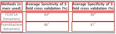
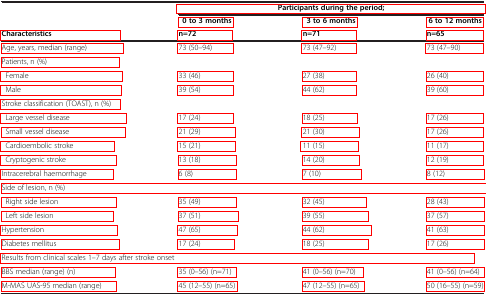
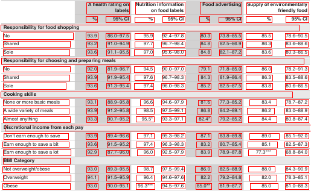

# LGPMA

This code repository contains the implementations of the paper [LGPMA: Complicated Table Structure Recognition with Local and Global Pyramid Mask Alignment](https://arxiv.org/pdf/2105.06224.pdf) (ICDAR 2021).


## Preparing Dataset
Original images can be downloaded from: [pubtabnet](https://developer.ibm.com/exchanges/data/all/pubtabnet/).

The test datalist and the example of formatted training datalist can be found in `demo/table_recognition/datalist/`

The whole formatted training/validating datalist can be downloaded refer to [datalist](../datalist/ReadMe.md).

## Training
Modified the paths of "ann_file", "img_prefix", "pretrained_model" and "work_space" in the config files `demo/table_recognition/lgpma/config/lgpma_pub.py`.

Run the following bash command in the command line,
``` shell
cd $DAVAR_LAB_OCR_ROOT$/demo/table_recognition/lgpma/
bash dist_train.sh
```
## Online evaluation 
We provide the online evaluation support that can be used to pick models during training. You can remove the tag `--no-validate` in the startup script `dist_train.sh`. 

Two evaluation metrics are supported:

- "TEDS": directly measures the similarity of the table structure. When using this metric, you need to convert the validating datalist (PubTabNet_2.0.0_val.jsonl) into json format same as the training set (refer to the script convert_jsonl_json.py).

- "hmen": measures the similarity between the detection results of aligned cells and its true value. When using this metric, you need to convert the validating datalist (PubTabNet_2.0.0_val.jsonl) into davar json format(refer to the script convert_html_ann.py).

> The online validation takes a relatively long time. it is recommended to use a small subset of the validation dataset.

## Offline Inference and Evaluation
We provide a demo of forward inference and evaluation on PubTabNet dataset. You can modify the paths (`savepath`, `config_file`, `checkpoint_file`) in test script, and start testing:

``` shell
python test_pub.py 
```

Some visualization of detection results are shown:









The offline evaluation tool can be found in `demo/table_recognition/lgpma/tools/eval_pub/`

## Table Structure Recognition
All of the models are re-implemented and well trained in the based on the opensourced framework mmdetection. So, the results might be slightly different from reported results.

Results on various datasets and trained models download:

| Dataset             | Test Scale | Bboxes refine  | TEDS-struc | Links |
|---------------------|------------|----------------|------------|-------|
| PubTabNet(reported) | L-768      | w              | 96.7       |       |
| PubTabNet           | 1.5x       | wo             | 96.7       | [config](configs/lgpma_pub.py), [pth](https://drive.hikvision.com/hcs/controller/hik-manage/fileDownload?link=HaUjsAlJ) (Access Code: dFtt)|
| PubTabNet           | 1.5x       | w              | 96.9       | Same as above link |

> The Trained Model on dataset SciTSR and ICDAR 2013 will release soon.

## Table Recognition with OCR Result

Here, we provide a demo to obtain the complete table result using LGPMA model, including the strcutre result and OCR result. 

The OCR models are trained on pubtabnet, including a single-line text detection model and a single-line recognition model.
(Since the dataset only provides the position of entire text region for each cell, the OCR models are trained on the 
instances that only contain single-line text. )

Notice that the orignal annoation in PubTabNet includes the font information like superscript, subscript, italic and bold. For simply, our recognition model ignores the font type.  Correspondingly, these font information in the ground-truth are also be removed in the following demonstrated evaluation results.
 
To run an inference demo, you can modify the model and config paths in the 'tool/test_pub_with_ocr.py' and directly run:

``` shell
python test_pub_with_ocr.py 
```

THe OCR model can be downloaded as follows, whose performances are evaluated on a self-divided validation set. 

| Models         | Precision | Recall  | Hmean    | Links |
|----------------|-----------|---------|----------|-------|
| Text Detection | 99.57     | 99.53   | 99.55    | [config](tools/ocr_models/det_mask_rcnn_r50_fpn_pubtabnet.py), [pth](https://drive.hikvision.com/hcs/controller/hik-manage/fileDownload?link=ZtMP7Cok) (Access Code: N243) |

| Models           | Accuracy  | Links |
|------------------|-----------|-------|
| Text recognition | 95.60     | [config](tools/ocr_models/rcg_res32_bilstm_attn_pubtabnet_sensitive.py), [pth](https://drive.hikvision.com/hcs/controller/hik-manage/fileDownload?link=AlPjG61i) (Access Code: FX26) |

The complete TEDS result on PubTabNet is as follows:


| Dataset   | Test Scale |  Bboxes refine |  TEDS-struc   |  TEDS   |
|-----------|------------|----------------|---------------|---------|
| PubTabNet | 1.5x       |       wo       |   96.7        |  94.7   |

## Citation

If you find this repository is helpful to your research, please feel free to cite us:

``` markdown
@inproceedings{qiao2021icdar21,
  title={LGPMA: Complicated Table Structure Recognition with Local and Global Pyramid Mask Alignment},
  author={Qiao, Liang and Li, Zaisheng and Cheng, Zhanzhan and Zhang, Peng and Pu, Shiliang and Niu, Yi and Ren, Wenqi and Tan, Wenming and Wu, Fei},
  booktitle={Document Analysis and Recognition-ICDAR 2021, 16th International Conference, Lausanne, Switzerland, September 5–10, 2021, Proceedings, Part I},
  pages={99-114},
  year={2021}
}
```
## License
This project is released under the [Apache 2.0 license](../../../davar_ocr/LICENSE)

## Copyright
If there is any suggestion and problem, please feel free to contact the author with qiaoliang6@hikvision.com, lizaisheng@hikvision.com or chengzhanzhan@hikvision.com.
