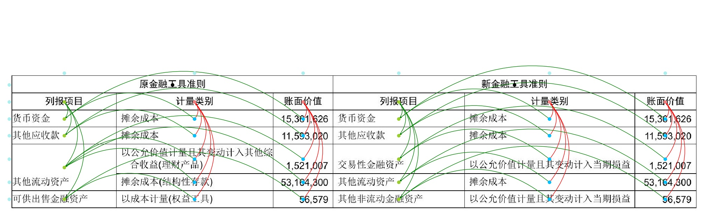
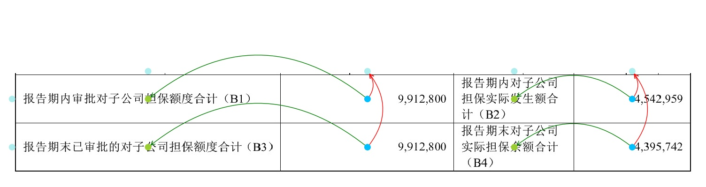
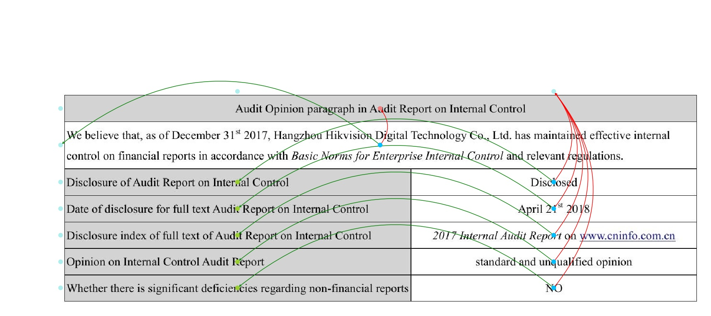
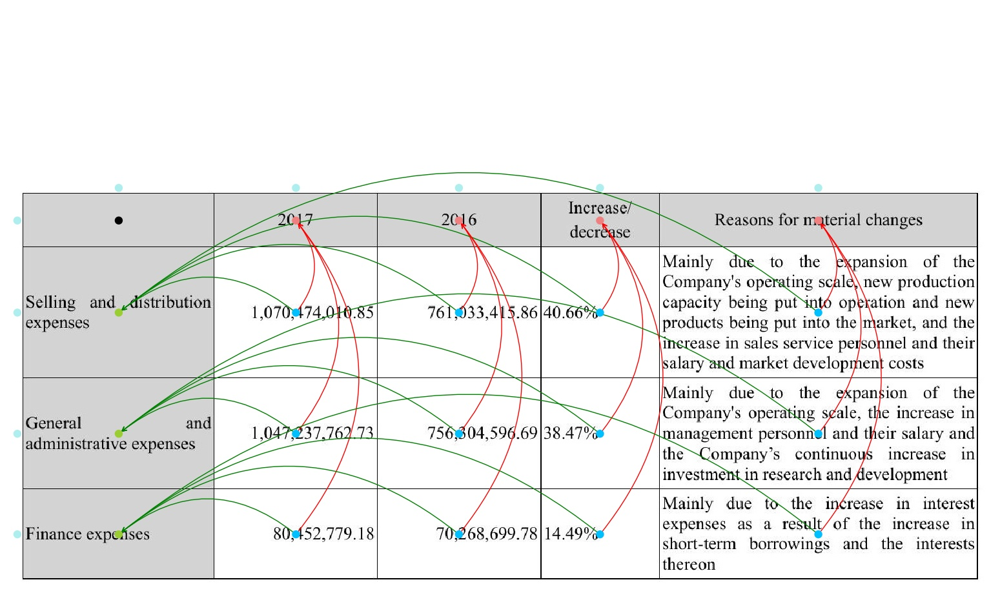

# CTUNet

This code repository contains the implementations of the paper [End-to-End Compound Table Understanding with Multi-Modal Modeling](https://dl.acm.org/doi/10.1145/3503161.3547885) (ACM MM 2022).

## Preparing Dataset
Original images and the whole formatted datalist can be downloaded from: [ComFinTab](https://davar-lab.github.io/dataset/comfintab.html).

The example of formatted datalist can be found in `demo/table_understanding/datalist/`

## Training
Modified the paths of "ann_file", "img_prefix", "pretrained_model" and "work_dir" in the config files `demo/table_understanding/ctunet/configs_clean/ctunet_chn.py`.

Run the following bash command in the command line,
``` shell
cd $DAVAR_LAB_OCR_ROOT$/demo/table_understanding/ctunet/
bash dist_train.sh
```
## Online evaluation
We provide the online evaluation support that can be used to pick models during training. Three evaluation metrics are supported:

- "macro_f1": measures the accuracy of cell type classification. Calculate f1-score for each category separately and then average it.

- "hard_f1": measures the similarity between the table items extraction results and ground truth. When two items are exactly the same, the similarity is 1. Otherwise 0.

- "tree_f1": measures the similarity between the table items extraction results and ground truth. When two items are exactly the same, the similarity is 1. Otherwise the similarity is their TEDS scores.

> In order to avoid the tables with a large number of cells affecting the overall evaluation indicators, the evaluation metrice are calculated based on each image and averaged in thie work. However, the 'macro_f1' used in online evaluation is still calculated based on traditional methods to speed up training.

## Offline Inference and Evaluation
We provide a demo of forward inference and evaluation on ConFinTab dataset. You can specify the paths of testing dataset(`ann_file`, `img_prefix`) and the paths to save the inference results in config.py, and start testing:

``` shell
cd $DAVAR_LAB_OCR_ROOT$/demo/table_understanding/ctunet/
bash dist_test.sh
```

## Visualization
We provide a visualization tools which can be found in `demo/table_understanding/tools/visualization.py`. You can specify the `ann_file_path`, `img_prefix` and `vis_dir`, and start visualization:

``` shell
python $DAVAR_LAB_OCR_ROOT$/demo/table_understanding/tools/visualization.py
```

Some visualization of cell types and the relationships are shown(paleturquoise nodes stands for the generated virtual node):









## Table Understanding using the ground truths of OCR and cells location
All of the models are re-implemented and well trained in the based on the opensourced framework mmdetection. So, the results might be slightly different from reported results.

Results on various datasets and trained models download:

| Dataset                    | Cell-F1   | Tree-P    | Tree-R    | Tree-F1   | link  |
|----------------------------|-----------|-----------|-----------|-----------|-------|
| ComFinTab-Chinese(reported)| 92.98     | 90.45     | 90.30     | 90.37     |       |
| ComFinTab-Chinese          | 93.59     | 90.38     | 90.69     | 90.44     | [config](configs/ctunet_chn.py), [pth](https://drive.ticklink.com/hcs/controller/hik-manage/fileDownload?link=5dI5gNoi&) (Access Code: jU2i)| 
| ComFinTab-English(reported)| 92.45     | 89.25     | 88.55     | 88.90     |       |
| ComFinTab-English          | 92.75     | 89.39     | 88.63     | 88.84     | [config](configs/ctunet_eng.py), [pth](https://drive.ticklink.com/hcs/controller/hik-manage/fileDownload?link=mALM3HSd&) (Access Code: stWG) |

## Citation

If you find this repository is helpful to your research, please feel free to cite us:

``` markdown
@inproceedings{li2022acmmm22,
  title={End-to-End Compound Table Understanding with Multi-Modal Modeling},
  author={Li, Zaisheng and Li, Yi and Liang, Qiao and Li, Pengfei and Cheng, Zhanzhan and Niu, Yi and Pu, Shiliang and Li, Xi},
  booktitle={Proceedings of the 30th ACM International Conference on Multimedia},
  pages={4112–4121},
  year={2022}
}
```
## License
This project is released under the [Apache 2.0 license](../../../davar_ocr/LICENSE). The dataset of ComFinTab is under the [Attribution-NonCommercial-ShareAlike 4.0 International (CC BY-NC-SA 4.0)](https://creativecommons.org/licenses/by-nc-sa/4.0/). 

## Contact
If there is any suggestion and problem, please feel free to contact the author with qiaoliang6@hikvision.com.