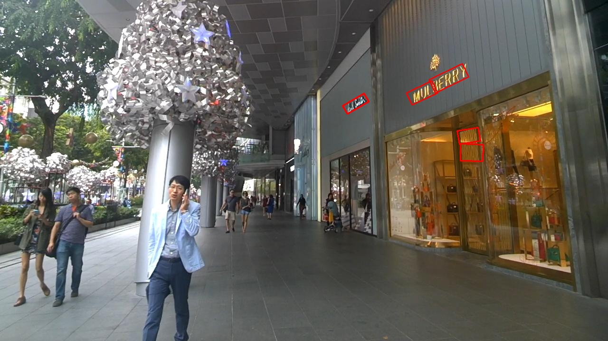
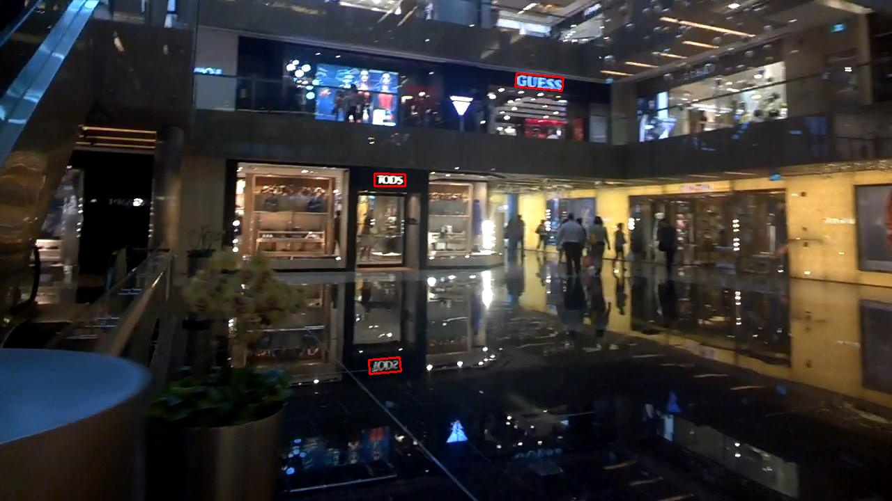

# EAST

This code repository contains an implementation of EAST Text detector. [EAST: An Efficient and Accurate Scene Text Detector](https://arxiv.org/pdf/1704.03155v2.pdf) (CVPR 2017).

## Preparing Dataset
Original images can be downloaded from: [ICDAR2015](https://github.com/?ch=4).

The formatted training datalist and test datalist can be found in `demo/text_detection/datalist/`

## Training
Modified the paths ("imgs"/ "pretrained_model"/ "work_space", etc.) in the config files `demo/text_detection/east/config/east_r50_rbox.py`.

Run the following bash command in the command line,
``` bash
>>> cd $DAVAR_LAB_OCR_ROOT$/demo/text_detection/east/
>>> bash dist_train.sh
```

> We provide the implementation of online validation. If you want to close it to save training time, you may modify the startup script to add `--no-validate` command.

## Offline Inference and Evaluation
We provide a demo of forward inference and visualization. You can modify the paths (`test_dataset`, `image_prefix`, etc.) in the testing script, and start testing:
``` bash
>>> python test.py 
```
Some visualization of detection results are shown:




### Offline Evaluation

The general evaluation tool can be found in [`davarocr/demo/text_detection/evaluation/`](../evalution/).

## Trained Model Download
All of the models are re-implemented and well trained in the based on the opensourced framework mmdetection.

Results on various datasets and trained models download:

|   Dataset      | Mode       | Backbone  | Pre-trained |Test Scale| Precision | Recall | Hmean | Links               |
| ---------------|--------    |---------- | ---------- | ----     |--------- | ------ | ----- | ------------------- |
| ICDAR2015 (Reported)     | RBOX    | PAVNET2x |  ImageNet    | (L-1280, S-720) |  83.57    | 73.47  | 78.20 | -        |
| ICDAR2015      | RBOX    | ResNet-50 |  ImageNet    | (L-1280, S-720) |  80.53    | 79.44  | 79.98 | [config](config/east_r50_rbox.py), [pth](https://pan.baidu.com/s/1uAaXN6iCVfIKniJPID6K5Q ) (Access Code: lgu5 )         |
| ICDAR2015      | RBOX    | ResNet-50 |  ImageNet    | (L-1600, S-900) |  79.45    | 80.4  | 79.92 | [config](config/east_r50_rbox.py), [pth](https://pan.baidu.com/s/1uAaXN6iCVfIKniJPID6K5Q ) (Access Code: lgu5 )         |
| ICDAR2015  (Reported)    | QUAD    | PAVNET2x |  ImageNet    | (L-1600, S-900) |  80.18    | 74.19  | 77.07 |  -       |
| ICDAR2015      | QUAD    | ResNet-50 |  ImageNet    | (L-1280, S-720) |  71.43   | 79.20  | 75.11 | [config](config/east_r50_quad.py), [pth](https://pan.baidu.com/s/1uAaXN6iCVfIKniJPID6K5Q ) (Access Code: lgu5 )         |
| ICDAR2015      | QUAD    | ResNet-50 |  ImageNet    | (L-1600, S-900) |  71.52   | 79.30  | 75.21 | [config](config/east_r50_quad.py), [pth](https://pan.baidu.com/s/1uAaXN6iCVfIKniJPID6K5Q ) (Access Code: lgu5 )         |

> Note: Models are stored in BaiduYunPan, and can also be downloaded from [Google Drive](https://drive.google.com/drive/folders/1dWZN2uMKMgJalHcBHWvpAuku1eyXq-Jj?usp=sharing)

## Citation

``` markdown
@inproceedings{Zhou_2017,
  title={EAST: An Efficient and Acccurate Scene Text Detector},
  author={Xinyu Zhou and Cong Yao and He Wen and Yuzhi Wang and Shuchang Zhou and Weiran He and Jiajun Liang},
  booktitle={2017 IEEE Conference on Computer Vision and Pattern Recognition (CVPR)},
  year={2017}
}
```

## License
This project is released under the [Apache 2.0 license](../../../davar_ocr/LICENSE)

## Copyright
If there is any suggestion and problem, please feel free to contact the author with qiaoliang6@hikvision.com or chengzhanzhan@hikvision.com.
