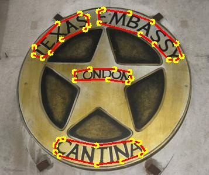
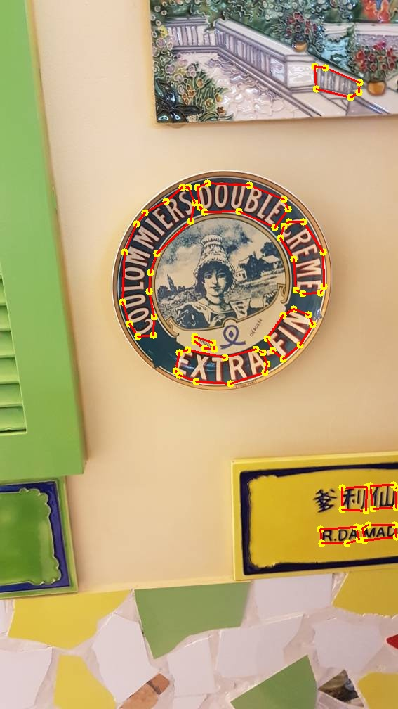

# Mask-RCNN Detector

This code repository contains an implementation of Mask-RCNN based Text detector.

## Preparing Dataset
Original images can be downloaded from: [ICDAR2015](https://github.com/?ch=4), [Total-Text](https://github.com/cs-chan/Total-Text-Dataset "Total-Text") , [SCUT-CTW1500](https://github.com/Yuliang-Liu/Curve-Text-Detector).

The formatted training datalist and test datalist can be found in `demo/text_detection/datalist/`

## Training
Modified the paths ("imgs"/ "pretrained_model"/ "work_space", etc.) in the config files `demo/text_detection/mask_rcnn_det/config/mask_rcnn_r50_fpn.py`.

Run the following bash command in the command line,
``` bash
>>> cd $DAVAR_LAB_OCR_ROOT$/demo/text_detection/mask_rcnn_det/
>>> bash dist_train.sh
```

> We provide the implementation of online validation. If you want to close it to save training time, you may modify the startup script to add `--no-validate` command.

## Offline Inference and Evaluation
We provide a demo of forward inference and visualization. You can modify the paths (`test_dataset`, `image_prefix`, etc.) in the testing script, and start testing:
``` bash
>>> python test.py 
```
Some visualization of detection results are shown:




### Offline Evaluation

The offline evaluation tool can be found in [`davarocr/demo/text_detection/evaluation/`](../evalution/).

## Trained Model Download
All of the models are re-implemented and well trained in the based on the opensourced framework mmdetection.

Results on various datasets and trained models download:

|   Dataset             | Backbone  | Pretrained |Test Scale| Precision | Recall | Hmean | Links               |
| --------------------- |---------- | ---------- | ----     |--------- | ------ | ----- | ------------------- |
| Total-Text            | ResNet-50 |  COCO      | L-1350| 84.90     | 82.26  | 83.56 | [config](config/mask_rcnn_r50_fpn_tt.py), [pth](https://pan.baidu.com/s/1VzKduWXSqMhmvX6YFmlCJQ) (Access Code: k17n)         |
| Total-Text            | ResNet-101|  COCO      |  L-1350|86.55     | 81.90  | 84.16 | [config](config/mask_rcnn_r101_fpn_tt.py), [pth](https://pan.baidu.com/s/1VzKduWXSqMhmvX6YFmlCJQ) (Access Code: k17n)         |
| SCUT-CTW1500          | ResNet-50 |  COCO      |  L-1080|83.22     | 77.15  | 80.07 | [config](config/mask_rcnn_r50_fpn_ctw.py), [pth](https://pan.baidu.com/s/1VzKduWXSqMhmvX6YFmlCJQ) (Access Code: k17n)         |
| SCUT-CTW1500 (considers NOT CARE)  | ResNet-50 |  COCO  |  L-1080|   | 87.65     | 77.63  | 82.33 | -       |
| SCUT-CTW1500          | ResNet-101 |  COCO     |  L-1080| 82.76     | 78.7  | 80.68 | [config](config/mask_rcnn_r101_ctw.py), [pth](https://pan.baidu.com/s/1VzKduWXSqMhmvX6YFmlCJQ) (Access Code: k17n)        |
| SCUT-CTW1500 (considers NOT CARE)  | ResNet-101| COCO   |  L-1080|   | 87.24     | 79.22  | 83.04 | -        |
| ICDAR 2015            | ResNet-50 | COCO       |  L-1600| 89.19     | 77.03     | 82.67 |[config](config/mask_rcnn_r101_ctw.py), [pth](https://pan.baidu.com/s/1VzKduWXSqMhmvX6YFmlCJQ) (Access Code: k17n)|
| ICDAR 2015            | ResNet-101 | COCO       | L-1600| 90.43     | 75.11     | 82.06|[config](config/mask_rcnn_r101_ctw.py), [pth](https://pan.baidu.com/s/1VzKduWXSqMhmvX6YFmlCJQ) (Access Code: k17n)|
> Note: Models are stored in BaiduYunPan, and can also be downloaded from [Google Drive](https://drive.google.com/drive/folders/1w2cwYiuneb2qRM3e-82pylIUqGr8hs0d?usp=sharing)
> Pretrained model on COCO can be download in the repository of [mmdetection/mask_rcnn](https://github.com/open-mmlab/mmdetection/tree/master/configs/mask_rcnn).

## Citation

``` markdown
@inproceedings{He_2017,
  title={Mask R-CNN},
  author={He, Kaiming and Gkioxari, Georgia and Dollar, Piotr and Girshick, Ross},
  booktitle={2017 IEEE International Conference on Computer Vision (ICCV)},
  year={2017}
}
```

## License
This project is released under the [Apache 2.0 license](../../../davar_ocr/LICENSE)

## Copyright
If there is any suggestion and problem, please feel free to contact the author with qiaoliang6@hikvision.com or chengzhanzhan@hikvision.com.
