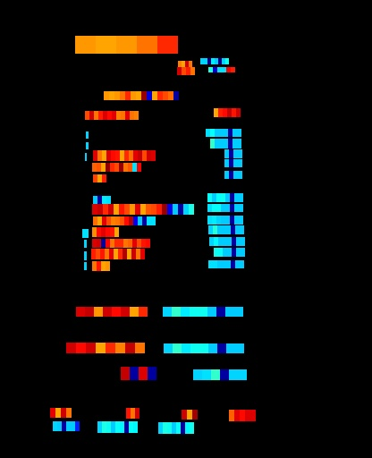
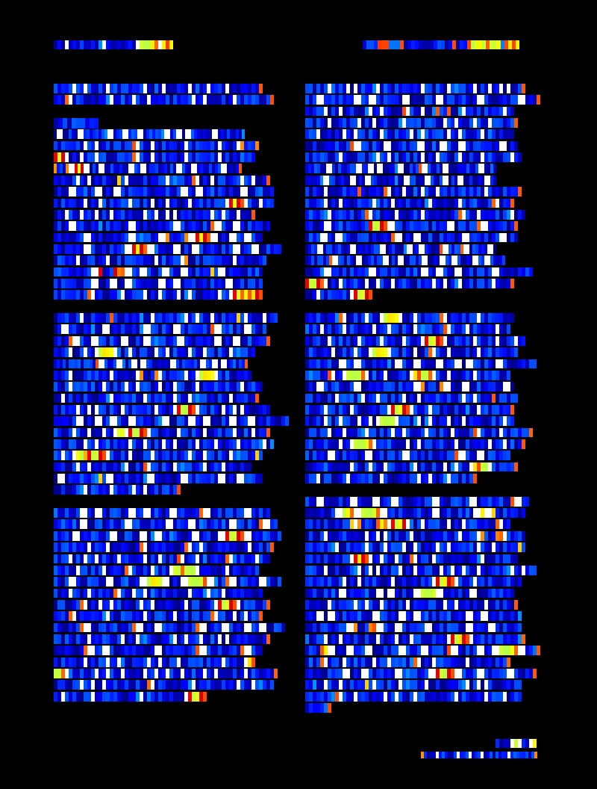
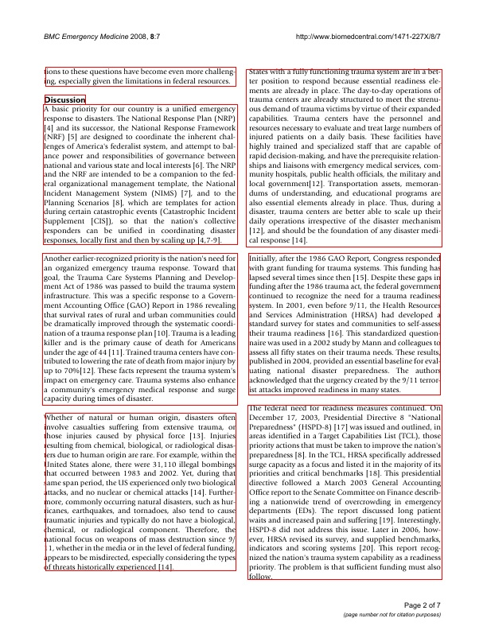

# Chargrid

This code repository contains the implementations of the paper [Chargrid: Towards Understanding 2D Documents](https://arxiv.org/pdf/1809.08799.pdf) (EMNLP, 2018).


## Preparing Dataset
- Wildreceipt: Original dataset can be downloaded from [MMOCR](https://github.com/open-mmlab/mmocr). Formatted training datalist and vocab used can be found in `demo/text_ie/datalist/wildreceipt`.
- [PubLayNet](https://github.com/ibm-aur-nlp/PubLayNet): PubLayNet is a large
 dataset of document images, of which the layout is annotated with both bounding boxes and polygonal segmentations. To perform multimodal layout analysis task, we also need to extract the annotations in the **character** granularity, in addition to layout component granularity. We provide demo datalist examples in `demo/text_ie/datalist/PubLayNet`, and one can get the above annotation through this [instruction](../../text_layout/datalist/readme.md).


## Train From Scratch
Temporarily, we release pretrained model on Wildreceipt (for visually information extraction task) dataset and PubLayNet (for layout reocognition task) dataset using OCR ground-truth.

If you want to re-implement the model's performance from scratch, please following these steps:

1.Firstly, download original dataset and unzip it to an arbitrary folder.

2.Secondly, 

- For Wildreceipt information extraction task, modify the paths in `demo/text_ie/chargrid/configs/wildreceipt_chargrid.py` including images path, datalists path, work space, etc.
- For PubLayNet layout analysis task, modify the paths in `demo/text_ie/chargrid/configs/publaynet_chargrid.py` including images path, datalists path, annotation files path, work space, etc.

3.Thirdly, directly run `demo/text_ie/chargrid/dist_train_wildreceipt.sh` or `demo/text_ie/chargrid/dist_train_publaynet.sh`.

> We provide the implementation of online validation

 ## Test

Given the trained model, directly run `demo/text_ie/chargrid/test_wildreceipt.sh` or `demo/text_ie/chargrid/test_publaynet.sh` to inference it.

To visualize generated chargrid map and PubLayNet detection result, you can modify the paths (**vis_dir** in `demo/text_ie/chargrid/test_chargrid.py` and **vis_save_dir** in test pipeline dict of files in `demo/text_ie/chargrid/configs/`) in testing and config scripts, then start testing:
``` shell
python test_chargrid.py 
```
Some visualization of generated chargrid maps and detection results are shown:
- WildReceipt


- PubLayNet





## Trained Model Download

All of the models are re-implemented and well trained based on the opensourced framework mmdetection. So, the results might be slightly different from reported results.

Results on various datasets and trained models can be download as follows:

|   Dataset   | Input | Task | Test Scale |   metric |  result | Links |
| :---------: | :---------: | :---------:| :--------: | :------: | :----:  |:------:|
| Wildreceipt |  Image  | Visually Information Extraction | (512, 512)  | F1-score | 67.10  | [config](./configs/wildreceipt_chargrid.py), [pth](https://drive.hikvision.com/hcs/controller/hik-manage/fileDownload?link=B8RAwc9V) (Access Code: P69m)|
| Wildreceipt |  Image+Chargrid  | Visually Information Extraction | (512, 512)  | F1-score | 81.02  | [config](./configs/wildreceipt_chargrid.py), [pth](https://drive.hikvision.com/hcs/controller/hik-manage/fileDownload?link=aD7ExRFR) (Access Code: RL1o)|
| PubLayNet   |    Image        |  Layout Recognition   | (1300, 800) |   mAP    | 71.9  | [config](./configs/publaynet_chargrid.py), [pth](https://drive.hikvision.com/hcs/controller/hik-manage/fileDownload?link=OdpzYcjb) (Access Code: Qc71)|
| PubLayNet   |    Image+Chargrid        |  Layout Recognition   | (1300, 800) |   mAP    | 71.8   | [config](./configs/publaynet_chargrid.py), [pth](https://drive.hikvision.com/hcs/controller/hik-manage/fileDownload?link=koWh2bal) (Access Code: 6ng0)|

> The PubLayNet results are report based on a sampled sub-set (1000) of the original dataset.

## Citation
``` markdown
@inproceedings{DBLP:conf/emnlp/KattiRGBBHF18,
  author    = {Anoop R. Katti and
               Christian Reisswig and
               Cordula Guder and
               Sebastian Brarda and
               Steffen Bickel and
               Johannes H{\"{o}}hne and
               Jean Baptiste Faddoul},
  title     = {Chargrid: Towards Understanding 2D Documents},
  booktitle = {EMNLP},
  pages     = {4459--4469},
  year      = {2018},
}
```
## License
This project is released under the [Apache 2.0 license](../../../davar_ocr/LICENSE)

## Copyright
If there is any suggestion and problem, please feel free to contact the author with qiaoliang6@hikvision.com.