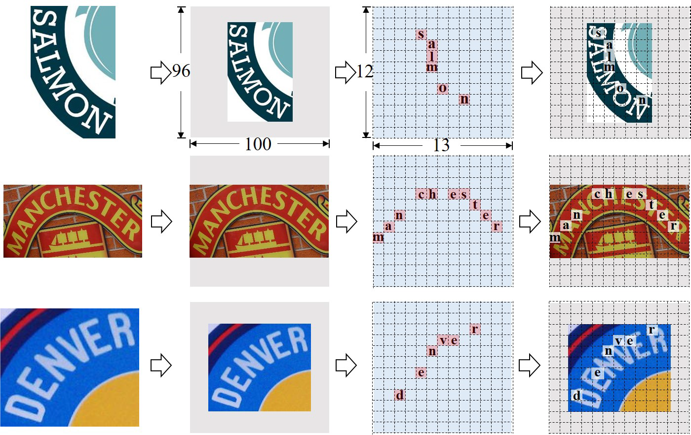

# ACE Loss

## 1. Introduction

Aggregation cross-entropy (ACE: [Aggregation Cross-Entropy for Sequence Recognition](https://arxiv.org/abs/1904.08364.pdf) (CVPR 2019)), for sequence recognition from a brand new perspective. ACE loss only requires only characters and their numbers in the sequence annotation for supervision, which allows it to advance beyond sequence recognition


## 2. Preparing Dataset

### Train Dataset

| Dataset | Samples |                         Description                          |                       Release                       |
| :-----: | :-----: | :----------------------------------------------------------: | :-------------------------------------------------: |
| MJSynth | 8919257 |          Scene text recognition synthetic data set           | [Link](https://www.robots.ox.ac.uk/~vgg/data/text/) |
| SynText | 7266164 | A synthesized by scene text dataset, and the text is cropped from the large image |   [Link](https://github.com/ankush-me/SynthText)    |

### Validation Dataset
|  Test Set  | Instance Number |   Note    |
| :-------: | :-------------: | :-------: |
|  IIIT5K   |      3000       |  regular  |
|    SVT    |       647       |  regular  |
| IC03_860  |       860       |  regular  |
| IC13_857  |       857       |  regular  |
| IC15_1811 |      1811       | irregular |
|   SVTP    |       645       | irregular |
|  CUTE80   |       288       | irregular |

### Test Dataset

|  Test Set  | Instance Number |   Note    |
| :-------: | :-------------: | :-------: |
|  IIIT5K   |      3000       |  regular  |
|    SVT    |       647       |  regular  |
| IC03_860  |       860       |  regular  |
| IC13_857  |       857       |  regular  |
| IC15_1811 |      1811       | irregular |
|   SVTP    |       645       | irregular |
|  CUTE80   |       288       | irregular |


## 3. Getting Started
### Preparation
A quick start is to use above lmdb-formatted datasets that contain the full benchmarks for scene text recognition tasks as belows.

```
Data Type: LMDB

File storage format:
   |-- train           
   |   |-- MJ
   |   |-- ST
   |-- validation
   |   |-- mixture
   |-- evaluation
   |   |-- mixture
```

### Training 

Run the following bash command in the command line,

```
cd .
bash ./train.sh
```
> We provide the implementation of online validation. If you want to close it to save training time, you may modify the startup script to add `--no-validate` command.

### Evaluation

```
cd ../test_scripts
bash ./test_ace.sh
```


## 4. Results

### Evaluation

<table>
    <tr>
        <td><strong><center>Methods</center></strong></td>
        <td colspan="4"><strong><center>Regular Text</center></strong></td>
        <td colspan="3"><strong><center>Irregular Text</center></strong></td> 
        <td colspan="2"><center><strong>Download</center></strong></td>
    <tr>
	<tr>
        <td><center> Name </center></td>
        <td><center> IIIT5K </center></td>
        <td><center> SVT </center></td>
        <td><center> IC03 </center></td>
        <td><center> IC13 </center></td>
        <td><center> IC15 </center></td>
        <td><center> SVTP </center></td>
        <td><center>CUTE80</center></td>
        <td><center>Config</center></td>
        <td><center>Model</center></td>
	<tr>
    <tr>
		<td><center> ACE Loss(Report) </center></td>
        <td><center> 82.3 </center></td>
        <td><center> 82.6 </center></td>
        <td><center> 92.1 </center></td>
        <td><center> - </center></td>
        <td><center> - </center></td>
        <td><center> - </center></td>
        <td><center> - </center></td>
        <td><center><p>-</p></center></td>
        <td><center><p>-</p></center></td>
	<tr>
    <tr>
		<td><center> ACE Loss </center></td>
        <td><center> 90.9 </center></td>
        <td><center> 84.2 </center></td>
        <td><center> 90.2 </center></td>
        <td><center> 90.1 </center></td>
        <td><center> 73.4 </center></td>
        <td><center> 71.9 </center></td>
        <td><center> 77.1 </center></td>
        <td><center><p><a href="./configs/res32_ace.py"> Config </a></p></center></td>
        <td><center><p> pth<a href="https://pan.baidu.com/s/1j__kSmlFLYZXGabsqpZKQQ"> BaiduYunPan </a>(Code:brey),<a href="https://drive.google.com/drive/folders/1gplNfTC4bbiAsQVDSnlttIZ0F1ASsZbj?usp=sharing"> Google Drive </a> </p></center></td>
	<tr>
<table>


### Visualization
Here is the picture for result visualization. 




## Citation

``` markdown
@inproceedings{ACE,
  author={Zecheng Xie and Yaoxiong Huang and Yuanzhi Zhu and Lianwen Jin and Yuliang Liu and Lele Xie},
  title={Aggregation Cross-Entropy for Sequence Recognition},
  booktitle={CVPR2019},
  pages={6538--6547},
  publisher={Computer Vision Foundation / {IEEE}},
  year={2019},
}
```


## License

This project is released under the [Apache 2.0 license](../../../davar_ocr/LICENSE)


## Copyright

If there is any suggestion and problem, please feel free to contact the author with jianghui11@hikvision.com or chengzhanzhan@hikvision.com.