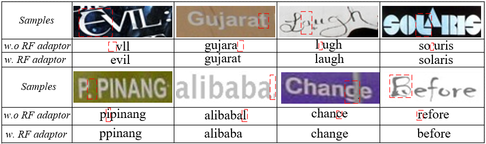

# RF-Learning

## 1. Introduction

This code repository contains an implementation of (RF-Learning: [Reciprocal Feature Learning via Explicit and Implicit Tasks in Scene Text Recognition](https://arxiv.org/abs/2105.06229.pdf) (ICDAR 2021)) . We excavate the implicit task, character counting within the traditional text recognition, without additional labor annotation cost. The implicit task plays as an auxiliary branch for complementing the sequential recognition. We design a two-branch reciprocal feature learning framework in order to adequately utilize the features from both the tasks. Through exploiting the complementary effect between explicit and implicit tasks, the feature is reliably enhanced.


## 2. Preparing Dataset

### Train Dataset

| Dataset | Samples |                         Description                          |                       Release                       |
| :-----: | :-----: | :----------------------------------------------------------: | :-------------------------------------------------: |
| MJSynth | 8919257 |          Scene text recognition synthetic data set           | [Link](https://www.robots.ox.ac.uk/~vgg/data/text/) |
| SynText | 7266164 | A synthesized by scene text dataset, and the text is cropped from the large image |   [Link](https://github.com/ankush-me/SynthText)    |

### Validation Dataset
|  Test Set  | Instance Number |   Note    |
| :-------: | :-------------: | :-------: |
|  IIIT5K   |      3000       |  regular  |
|    SVT    |       647       |  regular  |
| IC03_860  |       860       |  regular  |
| IC13_857  |       857       |  regular  |
| IC15_1811 |      1811       | irregular |
|   SVTP    |       645       | irregular |
|  CUTE80   |       288       | irregular |

### Test Dataset
|  Test Set  | Instance Number |   Note    |
| :-------: | :-------------: | :-------: |
|  IIIT5K   |      3000       |  regular  |
|    SVT    |       647       |  regular  |
| IC03_860  |       860       |  regular  |
| IC13_857  |       857       |  regular  |
| IC15_1811 |      1811       | irregular |
|   SVTP    |       645       | irregular |
|  CUTE80   |       288       | irregular |


## 3. Getting Started

### Preparation
A quick start is to use above lmdb-formatted datasets that contain the full benchmarks for scene text recognition tasks as belows.

```
Data Type: LMDB

File storage format:
   |-- train           
   |   |-- MJ
   |   |-- ST
   |-- validation
   |   |-- mixture
   |-- evaluation
   |   |-- mixture
```


### Training 

Run the following bash command in the command line,

```
cd .
bash ./train.sh 
```
> We provide the implementation of online validation. If you want to close it to save training time, you may modify the startup script to add `--no-validate` command.

### Evaluation

```
1.Visual Stage
  cd .
  bash ./test_scripts/test_rfl_visual.sh
1.Visual Stage
  cd .
  bash ./test_scripts/test_rfl_total.sh
```


## 4. Results

### Evaluation

<table>
    <tr>
        <td><strong><center>Methods</center></strong></td>
        <td colspan="4"><strong><center>Regular Text</center></strong></td>
        <td colspan="3"><strong><center>Irregular Text</center></strong></td> 
        <td colspan="2"><center><strong>Download</center></strong></td>
    <tr>
	<tr>
        <td><center> Name </center></td>
        <td><center> IIIT5K </center></td>
        <td><center> SVT </center></td>
        <td><center> IC03 </center></td>
        <td><center> IC13 </center></td>
        <td><center> IC15 </center></td>
        <td><center> SVTP </center></td>
        <td><center>CUTE80</center></td>
        <td><center>Config</center></td>
        <td><center>Model</center></td>
	<tr>
    <tr>
        <td><center> RF-Learning visual(Report)</center></td>
        <td><center> 95.7 </center></td>
        <td><center> 94.0 </center></td>
        <td><center> 96.0 </center></td>
        <td><center> 95.2 </center></td>
        <td><center> 84.2 </center></td>
        <td><center> 87.0 </center></td>
        <td><center> 85.8 </center></td>
        <td><center><p>-</p></center></td>
        <td><center><p>-</p></center></td>
	<tr>
    <tr>
        <td><center> RF-Learning visual</center></td>
        <td><center> 96.0 </center></td>
        <td><center> 94.7 </center></td>
        <td><center> 96.2 </center></td>
        <td><center> 95.9 </center></td>
        <td><center> 88.7 </center></td>
        <td><center> 86.7 </center></td>
        <td><center> 88.2 </center></td>
        <td><center><p><a href="./configs/res32_bilstm_visual.py"> Config </a></p></center></td>
        <td><center><p> pth <a href="https://pan.baidu.com/s/1nS4-s6TZdZM0LYXLQHy-TQ">BaiduYunPan </a> (Code:opjk),  <a href="https://drive.google.com/drive/folders/15n5b5XptYtvgZ3MfBpVpNoyNviJuknPb?usp=sharing">Google Drive </a> </p></center></td>
	<tr>
    <tr>
        <td><center> RF-Learning total(Report) </center></td>
        <td><center> 94.1 </center></td>
        <td><center> 88.6 </center></td>
        <td><center> 94.9 </center></td>
        <td><center> 94.5 </center></td>
        <td><center> 82.4 </center></td>
        <td><center> 82.0 </center></td>
        <td><center> 82.6 </center></td>
        <td><center><p>-</p></center></td>
        <td><center><p>-</p></center></td>
	<tr>  
    <tr>
        <td><center> RF-Learning total </center></td>
        <td><center> 94.5 </center></td>
        <td><center> 90.0 </center></td>
        <td><center> 94.0 </center></td>
        <td><center> 94.1 </center></td>
        <td><center> 81.5 </center></td>
        <td><center> 82.0 </center></td>
        <td><center> 84.7 </center></td>
        <td><center><p><a href="./configs/res32_bilstm_attn.py"> Config </a></p></center></td>
         <td><center><p> pth <a href="https://pan.baidu.com/s/1nS4-s6TZdZM0LYXLQHy-TQ">BaiduYunPan </a> (Code:opjk),  <a href="https://drive.google.com/drive/folders/1l-49Gl-R1nW5MYjqoEjvFgvibJbISSYx?usp=sharing">Google Drive </a> </p></center></td>
	<tr>
<table>


### Visualization
Here is the picture for result visualization. 




## Citation

``` markdown
@article{rflearning,
  author={Hui Jiang and Yunlu Xu and Zhanzhan Cheng and Shiliang Pu and Yi Niu and Wenqi Ren and Fei Wu and Wenming Tan},
  title={Reciprocal Feature Learning via Explicit and Implicit Tasks in Scene Text Recognition},
  journal={CoRR},
  volume={abs/2105.06229},
  year={2021},
}
```


## License

This project is released under the [Apache 2.0 license](../../../davar_ocr/LICENSE)


## Copyright

If there is any suggestion and problem, please feel free to contact the author with jianghui11@hikvision.com or chengzhanzhan@hikvision.com.