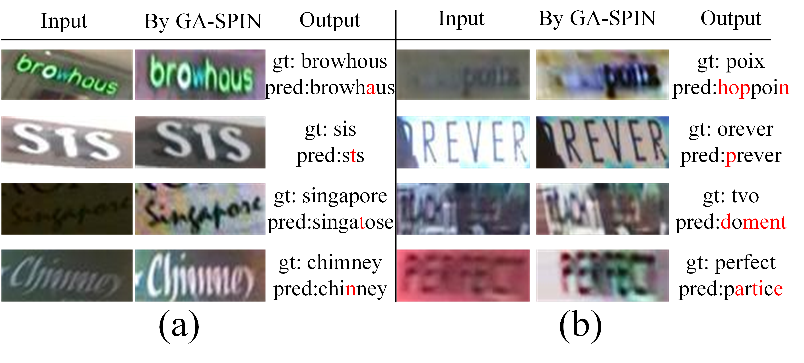

# SPIN

## 1 Introduction

This code repository contains an implementation of (SPIN: [SPIN: Structure-Preserving Inner Offset Network for Scene Text Recognition](https://arxiv.org/abs/2005.13117.pdf)  (AAAI2021) ). Chromatic diffculties in complex scenes have not been paid much attention on. We introduce a new learnable geometric-unrelated module,the Structure-Preserving Inner Offset Network (SPIN), which allows the color manipulation of source data within the network. 


## 2. Preparing Dataset

### Train Dataset

| Dataset | Samples |                         Description                          |                       Release                       |
| :-----: | :-----: | :----------------------------------------------------------: | :-------------------------------------------------: |
| MJSynth | 8919257 |          Scene text recognition synthetic data set           | [Link](https://www.robots.ox.ac.uk/~vgg/data/text/) |
| SynText | 7266164 | A synthesized by scene text dataset, and the text is cropped from the large image |   [Link](https://github.com/ankush-me/SynthText)    |

### Validation Dataset
|  Test Set  | Instance Number |   Note    |
| :-------: | :-------------: | :-------: |
|  IIIT5K   |      3000       |  regular  |
|    SVT    |       647       |  regular  |
| IC03_860  |       860       |  regular  |
| IC13_857  |       857       |  regular  |
| IC15_1811 |      1811       | irregular |
|   SVTP    |       645       | irregular |
|  CUTE80   |       288       | irregular |

### Test Dataset

|  Test Set  | Instance Number |   Note    |
| :-------: | :-------------: | :-------: |
|  IIIT5K   |      3000       |  regular  |
|    SVT    |       647       |  regular  |
| IC03_860  |       860       |  regular  |
| IC13_857  |       857       |  regular  |
| IC15_1811 |      1811       | irregular |
|   SVTP    |       645       | irregular |
|  CUTE80   |       288       | irregular |

## 3 Getting Started
### Preparation
A quick start is to use above lmdb-formatted datasets that contain the full benchmarks for scene text recognition tasks as belows.

```
Data Type: LMDB

File storage format:
   |-- train           
   |   |-- MJ
   |   |-- ST
   |-- validation
   |   |-- mixture
   |-- evaluation
   |   |-- mixture
```


### Training 

Run the following bash command in the command line,

```shell
cd .
bash ./train.sh 
```
> We provide the implementation of online validation. If you want to close it to save training time, you may modify the startup script to add `--no-validate` command.


### Evaluation
Run following scripts to compare different rectification modules.

```shell
cd .
bash ./test_scripts/test_affine.sh
```
```shell
cd .
bash ./test_scripts/test_tps.sh
```
```shell
cd .
bash ./test_scripts/test_spin.sh
```
```shell
cd .
bash ./test_scripts/test_gaspin.sh
```


## 4 Results

### Evaluation

<table>
    <tr>
        <td><strong><center>Methods</center></strong></td>
        <td colspan="4"><strong><center>Regular Text</center></strong></td>
        <td colspan="3"><strong><center>Irregular Text</center></strong></td> 
        <td colspan="2"><center><strong>Download</center></strong></td>
    <tr>
	<tr>
        <td><center> Name </center></td>
        <td><center> IIIT5K </center></td>
        <td><center> SVT </center></td>
        <td><center> IC03 </center></td>
        <td><center> IC13 </center></td>
        <td><center> IC15 </center></td>
        <td><center> SVTP </center></td>
        <td><center>CUTE80</center></td>
        <td><center>Config</center></td>
        <td><center>Model</center></td>
	<tr>
    <tr>
		<td><center> Affine(Report) </center></td>
        <td><center> - </center></td>
        <td><center> - </center></td>
        <td><center> - </center></td>
        <td><center> - </center></td>
        <td><center> - </center></td>
        <td><center> - </center></td>
        <td><center> - </center></td>
        <td><center><p>-</p></center></td>
        <td><center><p>-</p></center></td>
	<tr>
    <tr>
		<td><center> Affine </center></td>
        <td><center> 94.0 </center></td>
        <td><center> 87.9 </center></td>
        <td><center> 93.6 </center></td>
        <td><center> 94.4 </center></td>
        <td><center> 81.2 </center></td>
        <td><center> 80.9 </center></td>
        <td><center> 83.0 </center></td>
        <td><center><p><a href="./configs/affine_res32_attn.py"> Config </a></p></center></td>
        <td><center><p> pth <a href="https://drive.hikvision.com/hcs/controller/hik-manage/fileDownload?link=9i22WWfQ"> [Link] </a> (Access Code: 5nr1)</p></center></td>
	<tr>
    <tr>
		<td><center> TPS(Report) </center></td>
        <td><center> 87.9 </center></td>
        <td><center> 87.5 </center></td>
        <td><center> 94.9 </center></td>
        <td><center> 93.6 </center></td>
        <td><center> 77.6 </center></td>
        <td><center> 79.2 </center></td>
        <td><center> 74.0 </center></td>
        <td><center><p>-</p></center></td>
        <td><center><p>-</p></center></td>
	<tr>
    <tr>
		<td><center> TPS </center></td>
        <td><center> 94.2 </center></td>
        <td><center> 90.4 </center></td>
        <td><center> 94.5 </center></td>
        <td><center> 95.0 </center></td>
        <td><center> 82.1 </center></td>
        <td><center> 82.6 </center></td>
        <td><center> 83.7 </center></td>
        <td><center><p><a href="./configs/tps_res32_attn.py"> Config </a></p></center></td>
        <td><center><p> pth <a href="https://drive.hikvision.com/hcs/controller/hik-manage/fileDownload?link=GWZh1uvE"> [Link]</a> (Acceess Code: 024F)</p></center></td>
	<tr>
    <tr>
		<td><center> SPIN(Report) </center></td>
        <td><center> 94.7 </center></td>
        <td><center> 87.6 </center></td>
        <td><center> 93.4 </center></td>
        <td><center> 91.5 </center></td>
        <td><center> 79.1 </center></td>
        <td><center> 79.7 </center></td>
        <td><center> 85.1 </center></td>
        <td><center><p>-</p></center></td>
        <td><center><p>-</p></center></td>
	<tr>
    <tr>
		<td><center> SPIN </center></td>
        <td><center> 94.7 </center></td>
        <td><center> 89.8 </center></td>
        <td><center> 93.4 </center></td>
        <td><center> 94.1 </center></td>
        <td><center> 80.7 </center></td>
        <td><center> 82.2 </center></td>
        <td><center> 83.7 </center></td>
        <td><center>
            <p><a href="./configs/spin_res32_attn.py"> Config </a></p></center></td>
        <td><center><p> pth <a href="https://drive.hikvision.com/hcs/controller/hik-manage/fileDownload?link=D1euiL35"> [Link] </a> (Code:M45z)</p></center></td>
	<tr>
    <tr>
		<td><center> GA-SPIN(Report) </center></td>
        <td><center> 94.7 </center></td>
        <td><center> 90.3 </center></td>
        <td><center> 94.4 </center></td>
        <td><center> 92.8 </center></td>
        <td><center> 82.2 </center></td>
        <td><center> 82.8 </center></td>
        <td><center> 87.5 </center></td>
        <td><center><p>-</p></center></td>
        <td><center><p>-</p></center></td>
	<tr>
    <tr>
		<td><center> GA-SPIN </center></td>
        <td><center> 94.6 </center></td>
        <td><center> 89.0 </center></td>
        <td><center> 93.3 </center></td>
        <td><center> 94.2 </center></td>
        <td><center> 80.7 </center></td>
        <td><center> 83.0 </center></td>
        <td><center> 84.7 </center></td>
        <td><center>
            <p><a href="./configs/gaspin_res32_attn.py"> Config </a></p></center></td>
       <td><center><p> pth <a href="https://drive.hikvision.com/hcs/controller/hik-manage/fileDownload?link=1EapFDl8"> [Link] </a> (Access Code: 12q3)</p></center></td>
	<tr>
<table>


### Visualization

Here is the picture for result visualization. 




## Citation

``` markdown
@article{SPIN,
  title={SPIN: Structure-Preserving Inner Offset Network for Scene Text Recognition},
  author={Chengwei Zhang, Yunlu Xu, Zhanzhan Cheng, Shiliang Pu, Yi Niu, Fei Wu},
  journal={AAAI},
  year={2021}
}
```


## License

This project is released under the [Apache 2.0 license](../../../davar_ocr/LICENSE)


## Contact

If there is any suggestion and problem, please feel free to contact the author with qiaoliang6@hikvision.com.
