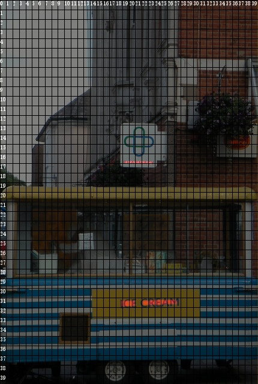
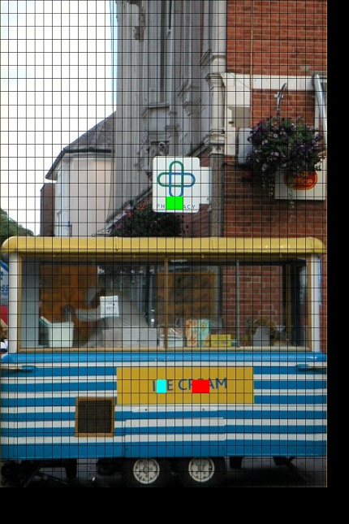
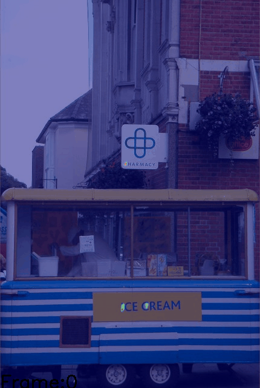

# MANGO

This code repository contains the implementations of the paper [MANGO: A Mask Attention Guided One-Stage Scene Text Spotter](https://arxiv.org/abs/2012.04350) (AAAI 2021).


## Preparing Dataset
Original images can be downloaded from: [Total-Text](https://github.com/cs-chan/Total-Text-Dataset "Total-Text") , [ICDAR2013](https://rrc.cvc.uab.es/?ch=2) , [ICDAR2015](https://rrc.cvc.uab.es/?ch=4), [ICDAR2017_MLT](https://rrc.cvc.uab.es/?ch=8), [ICDAR2019_MLT](https://rrc.cvc.uab.es/?ch=15)

The formatted training datalist can be found in `demo/text_spotting/datalist`

## Train On Your Own Dataset
1.Firstly, download the pre-trained model[[link](https://pan.baidu.com/s/18Zfgi7we8cXDMm8pt1Uwug) (Access Code: 677c)], which was well trained on SynthText and [SynthText_Curve](https://github.com/Yuliang-Liu/bezier_curve_text_spotting/)).

2.Modified the paths (`ann_file`, `img_prefix`, `work_dir`, etc..) in the config files `demo/text_spotting/mango/config/mango_r50_ete_finetune.py`.

3.Run the following bash command in the command line
``` bash
>>> cd $DAVAR_LAB_OCR_ROOT$/demo/text_spotting/mango/
>>> bash dist_train.sh
```
>Notice:We provide the implementation of online validation. If you want to close it to save training time, you may modify the startup script to add `--no-validate` command.

## Train From Scratch
If you want to re-implement the model's performance from scratch, please following these steps:

1.Firstly, pre-train the attention module using the SynthText containing character-level annotations. See `demo/text_spotting/mango/configs/mango_r50_att_pretrain.py` for more details.

2.Secondly, end-to-end training using the SynthText and SynthCurve containing only word-level annotations. See `demo/text_spotting/mango/configs/mango_r50_ete_pretrain.py` for more details.
> Notice:At the beginning of training, attention module and recognition module are trained together to prevent attention module from collapsing. The pretrained model is provided as mentioned above.

3.Thirdly, Fine-tune model on the mixed real dataset (include:ICADR2013~2019, Total-Text). See `demo/text_spotting/mango/configs/mango_r50_ete_finetune.py` for more details.

4.Finally, Fine-tune on the ICDAR2013, ICDAR2015 and Total-Text separately for testing and evaluation.
>Notice:Fine-tune on the ICDAR2015 with num_gird=60, and on the ICDAR2013 and Total-Text with num_grid=40

## Offline Inference and Evaluation
We provide a demo of forward inference and evaluation. You can modify the parameter (`iou_constraint`, `lexicon_type`, etc..) in the testing script, and start testing:
``` bash
>>> cd $DAVAR_LAB_OCR_ROOT$/demo/text_spotting/mango/tools/
>>> bash test_ic13.sh
```

The offline evaluation tool can be found in [`davarocr/demo/text_spotting/evaluation/`](../evalution/).

## Visualization
We provide a script to visualize the intermediate output results of the model, include visualization results of segmentation, activated grid map, text pred and attention map. You can modify the paths (`test_dataset`, `config_file`, etc..) in the script, and start generating 
visualization results:
``` bash
>>> cd $DAVAR_LAB_OCR_ROOT$/demo/text_spotting/mango/tools/
>>> python vis.py
```

Some visualization results are shown:






## Trained Model Download
All of the models are re-implemented and well trained in the based on the opensourced framework mmdetection. So, the results might be slightly different from reported results.

Results on various datasets and trained models download:
<table>
	<tr>
		<td>Pipeline</td>
		<td>Pretrained-Dataset</td>
		<td>Links</td>
	</tr>
	<tr>
		<td>resnet50+fpn+CMA+lstm</td>
		<td>SynthText<br>SynthCurve</td>
		<td><p><a href="./configs/mango_r50_ete_pretrain.py">cfg </a>, <a href="https://pan.baidu.com/s/18Zfgi7we8cXDMm8pt1Uwug">pth </a> (Access Code: 677c)</p></td>
	</tr>
	<tr>
		<td>resnet101+fpn+CMA+lstm</td>
		<td>SynthText<br>SynthCurve</td>
		<td><p><a href="./configs/mango_r101_ete_pretrain.py">cfg </a>, <a href="https://pan.baidu.com/s/18Zfgi7we8cXDMm8pt1Uwug">pth </a> (Access Code: 677c)</p></td>
	</tr>
</table>

<table>
	<tr>
		<td rowspan="2">Dataset</td>
		<td rowspan="2">Backbone</td>
		<td rowspan="2">Pretrained</td>
		<td rowspan="2">Mix-Finetune</td>
		<td rowspan="2">Specific-Finetune</td>
		<td rowspan="2">Test Scale</td>
		<td colspan="3">End-to-End</td>
		<td colspan="3">Word Spotting</td>
		<td rowspan="2">Links</td>
	</tr>
	<tr>
		<td>General</td>
		<td>Weak</td>
		<td>Strong</td>
		<td>General</td>
		<td>Weak</td>
		<td>Strong</td>
	</tr>
	<tr>
		<td>ICDAR2013<br>(Reported)</td>
		<td>ResNet-50</td>
		<td>SynthText<br>SynthCurve</td>
		<td>ICDAR2013<br>ICDAR2015<br>ICDAR2017_MLT<br>COCO-Text<br>Total-Text</td>
		<td>None</td>
		<td>L-1440</td>
		<td>86.9</td>
		<td>90.0</td>
		<td>90.5</td>
		<td>90.1</td>
		<td>94.1</td>
		<td>94.8</td>
		<td>-</td>
	</tr>
	<tr>
		<td>ICDAR2013</td>
		<td>ResNet-50</td>
		<td>SynthText<br>SynthCurve</td>
		<td>ICDAR2013<br>ICDAR2015<br>ICDAR2017_MLT<br>ICDAR2019_MLT<br>Total-Text</td>
		<td>None</td>
		<td>L-1440</td>
		<td>84.9</td>
		<td>88.6</td>
		<td>89.5</td>
		<td>88.4</td>
		<td>92.7</td>
		<td>93.7</td>
		<td><p><a href="./configs/mango_r50_ete_finetune.py">cfg </a>, <a href="https://pan.baidu.com/s/1G6G0hLCNdPxOS1e7dPbNOQ">pth </a> (Access Code: ay86)</p></td>
	</tr>
	<tr>
		<td>ICDAR2013</td>
		<td>ResNet-101</td>
		<td>SynthText<br>SynthCurve</td>
		<td>ICDAR2013<br>ICDAR2015<br>ICDAR2017_MLT<br>ICDAR2019_MLT<br>Total-Text</td>
		<td>None</td>
		<td>L-1440</td>
		<td>88</td>
		<td>90.3</td>
		<td>90.4</td>
		<td>90.7</td>
		<td>93.8</td>
		<td>94.0</td>
		<td><p><a href="./configs/mango_r101_ete_finetune.py">cfg </a>, <a href="https://pan.baidu.com/s/1G6G0hLCNdPxOS1e7dPbNOQ">pth </a> (Access Code: ay86)</p></td>
	</tr>
	<tr>
		<td>ICDAR2015 (Reported)</td>
		<td>ResNet-50</td>
		<td>SynthText<br>SynthCurve</td>
		<td>ICDAR2013<br>ICDAR2015<br>ICDAR2017_MLT<br>COCO-Text<br>Total-Text</td>
		<td>ICDAR2015</td>
		<td>L-1800</td>
		<td>67.3</td>
		<td>78.9</td>
		<td>81.8</td>
		<td>70.3</td>
		<td>83.1</td>
		<td>86.4</td>
		<td>-</td>
	</tr>
	<tr>
		<td>ICDAR2015</td>
		<td>ResNet-50</td>
		<td>SynthText<br>SynthCurve</td>
		<td>ICDAR2013<br>ICDAR2015<br>ICDAR2017_MLT<br>ICDAR2019_MLT<br>Total-Text</td>
		<td>ICDAR2015</td>
		<td>L-1800</td>
		<td>70.8</td>
		<td>77.4</td>
		<td>80.7</td>
		<td>73.8</td>
		<td>81.1</td>
		<td>85</td>
		<td><p><a href="./configs/mango_r50_ete_finetune.py">cfg </a>, <a href="https://pan.baidu.com/s/1kD-JTn1ecwLBxgG1dTPGBg">pth </a> (Access Code: pw8a)</p></td>
	</tr>
	<tr>
		<td>ICDAR2015</td>
		<td>ResNet-101</td>
		<td>SynthText<br>SynthCurve</td>
		<td>ICDAR2013<br>ICDAR2015<br>ICDAR2017_MLT<br>ICDAR2019_MLT<br>Total-Text</td>
		<td>ICDAR2015</td>
		<td>L-1800</td>
		<td>72.8</td>
		<td>79.8</td>
		<td>82.4</td>
		<td>75.7</td>
		<td>83.4</td>
		<td>86.6</td>
		<td><p><a href="./configs/mango_r101_ete_finetune.py">cfg </a>, <a href="https://pan.baidu.com/s/1kD-JTn1ecwLBxgG1dTPGBg">pth </a> (Access Code: pw8a)</p></td>
	</tr>
</table>

<table>
	<tr>
		<td rowspan="2">Dataset</td>
		<td rowspan="2">Backbone</td>
		<td rowspan="2">Pretrained</td>
		<td rowspan="2">Mix-Finetune</td>
		<td rowspan="2">Specific-Finetune</td>
		<td rowspan="2">Test Scale</td>
		<td colspan="2">End-to-End</td>
		<td colspan="2">Word Spotting</td>
		<td rowspan="2">Links</td>
	</tr>
	<tr>
		<td>None</td>
		<td>Full</td>
		<td>None</td>
		<td>Full</td>
	</tr>
	<tr>
		<td>Total-Text (Reported)</td>
		<td>ResNet-50</td>
		<td>SynthText<br>SynthCurve</td>
		<td>ICDAR2013<br>ICDAR2015<br>ICDAR2017_MLT<br>COCO-Text<br>Total-Text</td>
		<td>Total-Text</td>
		<td>L-1600</td>
		<td>-</td>
		<td>-</td>
		<td>72.9</td>
		<td>83.6</td>
		<td>-</td>
	</tr>
	<tr>
		<td>Total-Text</td>
		<td>ResNet-50</td>
		<td>SynthText<br>SynthCurve</td>
		<td>ICDAR2013<br>ICDAR2015<br>ICDAR2017_MLT<br>ICDAR2019_MLT<br>Total-Text</td>
		<td>Total-Text</td>
		<td>L-1600</td>
		<td>68.9</td>
		<td>78.9</td>
		<td>71.7</td>
		<td>82.7</td>
		<td><p><a href="./configs/mango_r50_ete_finetune.py">cfg </a>, <a href="https://pan.baidu.com/s/1NI1_Nl8gSDh9zTX-lof9OA">pth </a> (Access Code: 6rz6)</p></td>
	</tr>
	<tr>
		<td>Total-Text</td>
		<td>ResNet-101</td>
		<td>SynthText<br>SynthCurve</td>
		<td>ICDAR2013<br>ICDAR2015<br>ICDAR2017_MLT<br>ICDAR2019_MLT<br>Total-Text</td>
		<td>Total-Text</td>
		<td>L-1600</td>
		<td>70.2</td>
		<td>79.9</td>
		<td>73</td>
		<td>83.9</td>
		<td><p><a href="./configs/mango_r101_ete_finetune.py">cfg </a>, <a href="https://pan.baidu.com/s/1NI1_Nl8gSDh9zTX-lof9OA">pth </a> (Access Code: 6rz6)</p></td>
	</tr>
</table>
> Note: Models are stored in BaiduYunPan, and can also be downloaded from [Google Drive](https://drive.google.com/drive/folders/1VLVbdEabCSZ54dNLvbBsMaXV2nrGrx9G?usp=sharing)


## Citation
If you find this repository is helpful to your research, please feel free to cite us:

``` markdown
@inproceedings{qiao2021mango,
  title={MANGO: A Mask Attention Guided One-Stage Scene Text Spotter},
  author={Qiao, Liang and Chen, Ying and Cheng, Zhanzhan and Xu, Yunlu and Niu, Yi and Pu, Shiliang and Wu, Fei},
  booktitle={Proceedings of the Thirty-Fifth AAAI Conference on Artificial Intelligence (AAAI)},
  pages={2467-2476},
  year={2021}
}
```
## License
This project is released under the [Apache 2.0 license](../../../davar_ocr/LICENSE)

## Copyright
If there is any suggestion and problem, please feel free to contact the author with qiaoliang6@hikvision.com or chengzhanzhan@hikvision.com.