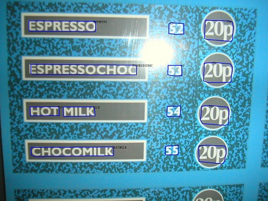

# Mask-RCNN Spotter
This code repository contains the implementation of a simple Mask-RCNN based Text Spotter. Many advanced text spotters are built based on such framework, e.g., 
- [Mask TextSpotter: An End-to-End Trainable Neural Network for Spotting Text with Arbitrary Shapes](https://arxiv.org/pdf/1908.08207.pdf) (ECCV 2018)
- [Towards Unconstrained End-to-End Text Spotting](https://arxiv.org/pdf/1908.09231.pdf) (ICCV 2019)
- [All You Need Is Boundary: Toward Arbitrary-Shaped Text Spotting](https://arxiv.org/pdf/1911.09550.pdf) (AAAI 2020)
- ...

## Preparing Dataset
Original images can be downloaded from: [Total-Text](https://github.com/cs-chan/Total-Text-Dataset "Total-Text") , [ICDAR2013](https://rrc.cvc.uab.es/?ch=2) , [ICDAR2015](https://rrc.cvc.uab.es/?ch=4), [ICDAR2017_MLT](https://rrc.cvc.uab.es/?ch=8), [ICDAR2019_MLT](https://rrc.cvc.uab.es/?ch=15)

The formatted training datalists can be found in `demo/text_spotting/datalist`

## Train On Your Own Dataset
1.Firstly, download the pre-trained model (well trained on SynthText), [[link](https://pan.baidu.com/s/1PdCalgmaIqRw28WuaDxDNg) (Access Code: et32)]

2.Modified the paths (`ann_file`, `img_prefix`, `work_dir`, etc..) in the config files `demo/text_spotting/mask_rcnn_spot/config/mask_rcnn_spotter_finetune.py`.

3.Run the following bash command in the command line
``` bash
>>> cd $DAVAR_LAB_OCR_ROOT$/demo/text_spotting/mask_rcnn_spot/
>>> bash dist_train.sh
```
>Notice:We provide the implementation of online validation. If you want to close it to save training time, you may modify the startup script to add `--no-validate` command.

## Train From Scratch
If you want to re-implement the model's performance from scratch, please following these steps:

1.Firstly, end-to-end pre-training using the SynthText containing only word-level annotations. See `demo/text_spotting/mask_rcnn_spot/configs/mask_rcnn_spotter_pretrain.py` for more details.

2.Secondly, Fine-tune model on the mixed real dataset (include:ICADR2013, ICDAR2015, ICDAR2017-MLT, ICDAR2019-MLT, Total-Text). See `demo/text_spotting/mask_rcnn_spot/configs/mask_rcnn_spotter_finetune.py` for more details.

3.Finally, Fine-tune on the training set of the specific dataset(e.g., ICDAR2013, ICDAR2015 and Total-Text) separately for testing and evaluation.

>Notice:We provide the implementation of online validation, if you want to close it to save training time, you may modify the startup script to add `--no-validate` command.

## Offline Inference and Evaluation
We provide a demo of forward inference and evaluation. You can modify the parameter (`iou_constraint`, `lexicon_type`, etc..) in the testing script, and start testing:
``` bash
>>> cd $DAVAR_LAB_OCR_ROOT$/demo/text_spotting/mask_rcnn_spot/tools/
>>> bash test_ic13.sh
```

The offline evaluation tool can be found in [`davarocr/demo/text_spotting/evaluation/`](../evalution/).

## Visualization
We provide a script to visualize the intermediate output results of the model. You can modify the paths (`test_dataset`, `config_file`, etc..) in the script, and start generating visualization results:
``` bash
>>> cd $DAVAR_LAB_OCR_ROOT$/demo/text_spotting/mask_rcnn_spot/tools/
>>> python vis.py
```

Some visualization results are shown:




## Trained Model Download
All of the models are re-implemented and well trained in the based on the opensourced framework mmdetection.

Results on various datasets and trained models download:
<table>
	<tr>
		<td>Pipeline</td>
		<td>Pretrained-Dataset</td>
		<td>Links</td>
	</tr>
	<tr>
		<td>mask_rcnn_r50_fpn+rcg_r32+lstm+attention</td>
		<td>SynthText</td>
		<td><p><a href="./configs/mask_rcnn_spotter_pretrain.py">cfg </a>, <a href="https://pan.baidu.com/s/1PdCalgmaIqRw28WuaDxDNg">pth </a> (Access Code: et32)</p></td>
	</tr>
</table>

<table>
	<tr>
		<td rowspan="2">Dataset</td>
		<td rowspan="2">Backbone</td>
		<td rowspan="2">Pretrained</td>
		<td rowspan="2">Mix-Finetune</td>
		<td rowspan="2">Specific-Finetune</td>
		<td rowspan="2">Test Scale</td>
		<td colspan="3">End-to-End</td>
		<td colspan="3">Word Spotting</td>
		<td rowspan="2">Links</td>
	</tr>
	<tr>
		<td>General</td>
		<td>Weak</td>
		<td>Strong</td>
		<td>General</td>
		<td>Weak</td>
		<td>Strong</td>
	</tr>
	<tr>
		<td>ICDAR2013</td>
		<td>ResNet-50</td>
		<td>SynthText</td>
		<td>ICDAR2013<br>ICDAR2015<br>ICDAR2017_MLT<br>ICDAR2019_MLT<br>Total-Text</td>
		<td>None</td>
		<td>L-1440</td>
		<td>82.69</td>
		<td>86.06</td>
		<td>86.59</td>
		<td>86.13</td>
		<td>90.44</td>
		<td>91.11</td>
		<td><p><a href="./configs/mask_rcnn_spotter_finetune.py">cfg </a>, <a href="https://pan.baidu.com/s/1V6MEviBJCCkxlWe2JKFjNw">pth </a> (Access Code: 5j3c)</p></td>
	</tr>
	<tr>
		<td>ICDAR2015</td>
		<td>ResNet-50</td>
		<td>SynthText</td>
		<td>ICDAR2013<br>ICDAR2015<br>ICDAR2017_MLT<br>ICDAR2019_MLT<br>Total-Text</td>
		<td>ICDAR2015</td>
		<td>L-1800</td>
		<td>67.82</td>
		<td>72.17</td>
		<td>75.68</td>
		<td>70.14</td>
		<td>75.05</td>
		<td>79.13</td>
		<td><p><a href="./configs/mask_rcnn_spotter_finetune.py">cfg </a>, <a href="https://pan.baidu.com/s/1ei1mGacjBG6yxp1W_fC6jA">pth </a> (Access Code: ne5l)</p></td>
	</tr>
</table>

<table>
	<tr>
		<td rowspan="2">Dataset</td>
		<td rowspan="2">Backbone</td>
		<td rowspan="2">Pretrained</td>
		<td rowspan="2">Mix-Finetune</td>
		<td rowspan="2">Specific-Finetune</td>
		<td rowspan="2">Test Scale</td>
		<td colspan="2">End-to-End</td>
		<td colspan="2">Word Spotting</td>
		<td rowspan="2">Links</td>
	</tr>
	<tr>
		<td>None</td>
		<td>Full</td>
		<td>None</td>
		<td>Full</td>
	</tr>
	<tr>
		<td>Total-Text</td>
		<td>ResNet-50</td>
		<td>SynthText</td>
		<td>ICDAR2013<br>ICDAR2015<br>ICDAR2017_MLT<br>ICDAR2019_MLT<br>Total-Text</td>
		<td>Total-Text</td>
		<td>L-1350</td>
		<td>62.77</td>
		<td>71.48</td>
		<td>65.25</td>
		<td>75.82</td>
		<td><p><a href="./configs/mask_rcnn_spotter_finetune.py">cfg </a>, <a href="https://pan.baidu.com/s/1TVmG8hh9r9mWfdaNynkqSg">pth </a> (Access Code: 7npy)</p></td>
	</tr>
</table>
> Note: Models are stored in BaiduYunPan, and can also be downloaded from [Google Drive](https://drive.google.com/drive/folders/1tFtLw1Lm6Lc3ve_wNwrmedJ5dS0HPSh9?usp=sharing)


## Citation:

``` markdown
@inproceedings{He_2017,
  title={Mask R-CNN},
  author={He, Kaiming and Gkioxari, Georgia and Dollar, Piotr and Girshick, Ross},
  booktitle={2017 IEEE International Conference on Computer Vision (ICCV)},
  year={2017}
}
```

## License
This project is released under the [Apache 2.0 license](../../../davar_ocr/LICENSE)

## Copyright
If there is any suggestion and problem, please feel free to contact the author with qiaoliang6@hikvision.com or chengzhanzhan@hikvision.com.