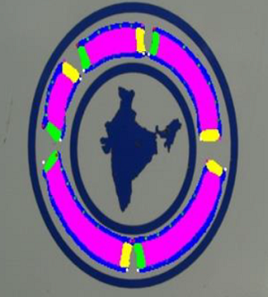

# Text Perceptron Spotter

This code repository contains the implementations of the paper [Text Perceptron: Towards End-to-End Arbitrary-Shaped Text Spotting](https://arxiv.org/pdf/2002.06820.pdf) (AAAI 2020).

## Preparing Dataset
Original images can be downloaded from: [Total-Text](https://github.com/cs-chan/Total-Text-Dataset "Total-Text") , [ICDAR2013](https://rrc.cvc.uab.es/?ch=2) , [ICDAR2015](https://rrc.cvc.uab.es/?ch=4), [ICDAR2017_MLT](https://rrc.cvc.uab.es/?ch=8).

The formatted training datalist and test datalist can be found in [`demo/text_spotting/datalist/`](../datalist).


## Train On Your Own Dataset
1.Download the pre-trained model (well trained on SynthText and COCO-Text), [[link](https://pan.baidu.com/s/1KDWKlhU3s1WcKBBpKw9leA) (Access Code: hnda)]

2.Modified the paths (`ann_file`, `img_prefix`, `work_dir`, etc..) in the config files [`demo/text_spotting/text_perceptron_spot/config/tp_r50_e2e_finetune.py`](./configs/tp_r50_e2e_finetune.py).

3.Run the following bash command in the command line
``` shell
cd $DAVAR_LAB_OCR_ROOT$/demo/text_spotting/text_perceptron_spot/
bash dist_train.sh
```
>Notice:We provide the implementation of online validation. If you want to close it to save training time, you may modify the startup script to add `--no-validate` command.

## Train From Scratch
If you want to re-implement the model's performance from scratch, please following these steps:

1.End-to-End pre-training using the SynthText and COCO-Text. See [`demo/text_spotting/text_perceptron_spot/configs/tp_r50_e2e_pretrain.py`](./configs/tp_r50_e2e_pretrain.py) for more details.

2.Fine-tune model on the mixed real dataset (include:ICADR2013, ICDAR2015, ICDAR2017-MLT, Total-Text). See [`demo/text_spotting/text_perceptron_spot/configs/tp_r50_e2e_finetune.py`](./configs/tp_r50_e2e_finetune.py) for more details.

>Notice:We provide the implementation of online validation, if you want to close it to save training time, you may modify the startup script to add `--no-validate` command.

## Offline Inference and Evaluation
We provide a demo of forward inference and evaluation. You can modify the parameter (`iou_constraint`, `lexicon_type`, etc..) in the testing script, and start testing:
``` shell
cd $DAVAR_LAB_OCR_ROOT$/demo/text_spotting/text_perceptron_spot/tools/
bash test_ic13.sh
```

The offline evaluation tool can be found in [`davarocr/demo/text_spotting/evaluation/`](../evaluation).

## Visualization
We provide a script to visualize the intermediate output results of the model. You can modify the paths (`test_dataset`, `config_file`, etc..) in the script, and start generating visualization results:
``` shell
cd $DAVAR_LAB_OCR_ROOT$/demo/text_spotting/text_perceptron_spot/tools/
python vis.py
```

Some visualization results are shown:




## Trained Model Download
All of the models are re-implemented and well trained in the based on the opensourced framework mmdetection.

Results on various datasets and trained models download:
<table>
	<tr>
		<td>Pipeline</td>
		<td>Pretrained-Dataset</td>
		<td>Links</td>
	</tr>
	<tr>
		<td>tp_r50_fpn+conv6+bilstm+attention</td>
		<td>SynthText<br>COCO-Text</td>
		<td><p><a href="./configs/tp_r50_e2e_pretrain.py">cfg </a>, <a href="https://pan.baidu.com/s/1KDWKlhU3s1WcKBBpKw9leA">pth </a> (Access Code: hnda)</p></td>
	</tr>
</table>

<table>
	<tr>
		<td rowspan="2">Dataset</td>
		<td rowspan="2">Backbone</td>
		<td rowspan="2">Pretrained</td>
		<td rowspan="2">Finetune</td>
		<td rowspan="2">Test Scale</td>
		<td colspan="3">End-to-End</td>
		<td colspan="3">Word Spotting</td>
		<td rowspan="2">Links</td>
	</tr>
	<tr>
		<td>General</td>
		<td>Weak</td>
		<td>Strong</td>
		<td>General</td>
		<td>Weak</td>
		<td>Strong</td>
	</tr>
	<tr>
		<td>ICDAR2013<br>(Reported)</td>
		<td>ResNet-50-3stages-enlarge</td>
		<td>SynthText</td>
		<td>-</td>
		<td>L-1440</td>
		<td>85.8</td>
		<td>90.7</td>
		<td>91.4</td>
		<td>88.5</td>
		<td>94.0</td>
		<td>94.9</td>
		<td>-</td>
	</tr>
	<tr>
		<td>ICDAR2013</td>
		<td>ResNet-50</td>
		<td>SynthText<br>COCO-Text</td>
		<td>ICDAR2013<br>ICDAR2015<br>ICDAR2017_MLT<br>Total-Text</td>
		<td>L-1440</td>
		<td>87.4</td>
		<td>90.6</td>
		<td>91.2</td>
		<td>90.9</td>
		<td>93.8</td>
		<td>94.2</td>
		<td><p><a href="./configs/tp_r50_e2e_finetune.py">cfg </a>, <a href="https://pan.baidu.com/s/1U7CDtbTTpZ11zw0Vg7zYYA">pth </a> (Access Code: 20bj)</p></td>
	</tr>
	<tr>
		<td>ICDAR2015<br>(Reported)</td>
		<td>ResNet-50-3stages-enlarge</td>
		<td>SynthText</td>
		<td>-</td>
		<td>L-2000</td>
		<td>65.1</td>
		<td>76.6</td>
		<td>80.5</td>
		<td>67.9</td>
		<td>79.4</td>
		<td>84.1</td>
		<td>-</td>
	</tr>
	<tr>
		<td>ICDAR2015</td>
		<td>ResNet-50</td>
		<td>SynthText<br>COCO-Text</td>
		<td>ICDAR2013<br>ICDAR2015<br>ICDAR2017_MLT<br>Total-Text</td>
		<td>L-2000</td>
		<td>70.3</td>
		<td>77.0</td>
		<td>80.0</td>
		<td>70.8</td>
		<td>79.8</td>
		<td>83.2</td>
		<td><p><a href="./configs/tp_r50_e2e_finetune.py">cfg </a>, <a href="https://pan.baidu.com/s/1U7CDtbTTpZ11zw0Vg7zYYA">pth </a> (Access Code: 20bj)</p></td>
	</tr>
</table>

<table>
	<tr>
		<td rowspan="2">Dataset</td>
		<td rowspan="2">Backbone</td>
		<td rowspan="2">Pretrained</td>
		<td rowspan="2">Finetune</td>
		<td rowspan="2">Test Scale</td>
		<td colspan="2">End-to-End</td>
		<td colspan="2">Word Spotting</td>
		<td rowspan="2">Links</td>
	</tr>
	<tr>
		<td>None</td>
		<td>Full</td>
		<td>None</td>
		<td>Full</td>
	</tr>
	<tr>
		<td>Total-Text<br>(Reported)</td>
		<td>ResNet-50</td>
		<td>SynthText</td>
		<td>-</td>
		<td>L-1350</td>
		<td>-</td>
		<td>-</td>
		<td>69.7</td>
		<td>78.3</td>
		<td>-</td>
	</tr>
	<tr>
		<td>Total-Text</td>
		<td>ResNet-50</td>
		<td>SynthText<br>COCO-Text</td>
		<td>ICDAR2013<br>ICDAR2015<br>ICDAR2017_MLT<br>Total-Text</td>
		<td>L-1350</td>
		<td>70.7</td>
		<td>77.3</td>
		<td>73.9</td>
		<td>81.8</td>
		<td><p><a href="./configs/tp_r50_e2e_finetune.py">cfg </a>, <a href="https://pan.baidu.com/s/1U7CDtbTTpZ11zw0Vg7zYYA">pth </a> (Access Code: 20bj)</p></td>
	</tr>
</table>

> **Note**: Above links are from BaiduYunPan. Models can also be downloaded from [Google Drive](https://drive.google.com/drive/folders/1xQXdHRvBNmm2J7jt5zkDAfQ7Xw54COr9?usp=sharing)

## Citation:

``` markdown
@inproceedings{qiao2020text,
  title={Text Perceptron: Towards End-to-End Arbitrary-Shaped Text Spotting},
  author={Qiao, Liang and Tang, Sanli and Cheng, Zhanzhan and Xu, Yunlu and Niu, Yi and Pu, Shiliang and Wu, Fei},
  booktitle={Proceedings of the Thirty-Fourth AAAI Conference on Artificial Intelligence (AAAI)},
  pages={11899-11907},
  year={2020}
}
```

## License
This project is released under the [Apache 2.0 license](../../../davar_ocr/LICENSE)

## Copyright
If there is any suggestion and problem, please feel free to contact the author with qiaoliang6@hikvision.com or chengzhanzhan@hikvision.com.
