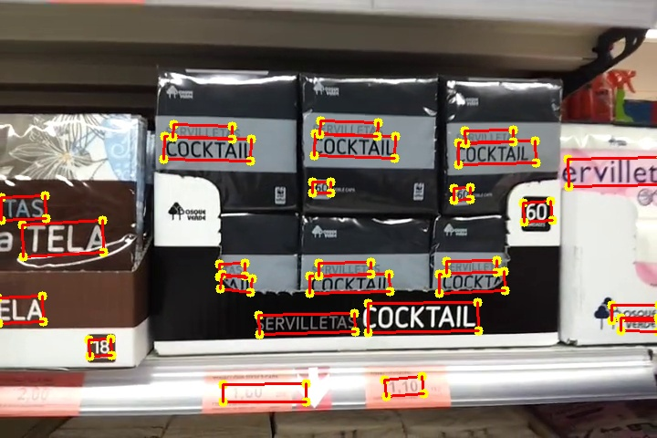

# YORO

This code repository contains the implementations of the paper [You Only Recognize Once: Towards Fast Video Text Spotting](https://arxiv.org/pdf/1903.03299.pdf). (ACM MM 2019)

## Preparing Dataset
Datasets used in experiments can be downloaded from: [Text in Videos ICDAR2013/ICDAR2015](https://rrc.cvc.uab.es/?ch=3&com=downloads).

For accessing the LSVTD (the Large Scene Video Text Dataset), You can refer to : [LSVTD](http://tc11.cvc.uab.es/datasets/LSVTD_1)

The formatted training datalist and test datalist can be found in `demo/videotext/datalist/`

## Training
1. Detection Training
    1. We first train the pre-train model of text detection branch, using the detector of [EAST](../../text_detection/east),  on dataset "Text in Videos ICDAR2015" and "Incidental Scene Text ICDAR2015"
        
        Modify the paths ("ann_file"/ "img_prefix"/ "work_dir", etc.) in the config files `demo/videotext/yoro/det/config/east_r50_rbox.py`.

        Run the following bash command in the command line,
        ``` shell
        cd $DAVAR_LAB_OCR_ROOT$/demo/videotext/yoro/det/
        bash base_dist_train.sh
        ```
        > trained model can be downloaded in [pth](https://one.hikvision.com/#/link/28AXkyPRF3IKR2MKUjoM) (Access code: tBhn)
        
    2. Extract optical flow information, using TVL1 algorithm in opencv2
    
        Modify the paths ("path"/ "output_path"/, etc.) in the script `demo/videotext/yoro/scripts/extract_flow.py`
        
        Run the following bash command in the command line,
        ``` shell
        cd $DAVAR_LAB_OCR_ROOT$/demo/videotext/yoro/scripts/
        python extract_flow.py
        ```
     
    3. Fine-tune the Spatial-temporal detector on dataset "Text in Videos ICDAR2015"
    
        Modify the paths ("ann_file"/ "img_prefix"/ "work_dir", etc.) in the config files `demo/videotext/yoro/det/config/yoro_east.py`.
    
        Run the following bash command in the command line,
        ``` bash
        cd $DAVAR_LAB_OCR_ROOT$/demo/videotext/yoro/det/
        bash dist_train.sh
        ```
        > trained models in IC13-ViT and IC15-ViT can be downloaded in [pth](https://one.hikvision.com/#/link/ss9cEvHgePJNhFaHrJQx) (Access code: HvnH) and  [pth](https://one.hikvision.com/#/link/wsDwouirnOA5DRTA0ShQ) (Access code: gj0n) 
                                                                                                                                                                                                                                                                                                                                                                                                                         
2. Text Recommender Training
    1. We first only train the recognition branch.

        Modify the paths ("ann_file"/ "img_prefix"/ "work_dir", etc.) in the config files `demo/videotext/yoro/rcg/config/ic15_rgb_res32_bilstm_attn.py`.
    
        Run the following bash command in the command line,
        ``` shell
        cd $DAVAR_LAB_OCR_ROOT$/demo/videotext/yoro/rcg/
        bash train_rcg.sh
        ```
       > trained model can be downloaded in [pth](https://one.hikvision.com/#/link/BEwWRYON3iFa0cwOZ7Rh) (Access code: N5el)
    
    2. Fix the recognition branch and only train the track branch.

        Modify the paths ("work_dir"/ "load_from"/, etc.) in the config files `demo/videotext/yoro/rcg/config/ic15_track_rgb_res32_bilstm_attn.py`.
    
        Run the following bash command in the command line,
        ``` shell
        cd $DAVAR_LAB_OCR_ROOT$/demo/videotext/yoro/rcg/
        bash track_train.sh
        ```
       > trained model can be downloaded in [pth](https://one.hikvision.com/#/link/FaBvjMxt0xp3IAMKE7Vc) (Access code: 6ZOU)
    3. Generate gt quality scores for train data list.

        Modify the paths ("out_path/"AnnFile"/ "ModelPath"/, etc.) in the config files `demo/videotext/yoro/rcg/test_scripts/config/config_gt_score.py`.
        
        Run the following bash command in the command line,
        ``` shell
        cd $DAVAR_LAB_OCR_ROOT$/demo/videotext/yoro/rcg/test_scripts/
        bash gen_train_score.sh
        ```
    
    4. Finally, fix the recognition and track branch, only train the quality score branch
        
        Modify the paths ("ann_files/"work_dir"/ "load_from"/, etc.) in the config files `demo/videotext/yoro/rcg/config/ic15_qscore_rgb_res32_bilstm_attn.py`.
        
        Run the following bash command in the command line,
        ``` shell
        cd $DAVAR_LAB_OCR_ROOT$/demo/videotext/yoro/rcg/
        bash qscore_train.sh
        ```
        > trained model can be downloaded in [pth](https://one.hikvision.com/#/link/va1QhZ1IAcJZeoQIYT5x) (Access code: BfGr)
    
    

## Offline Inference and Evaluation
1. Detection Test
    
    Modify the paths ("test_dataset"/ "image_prefix"/ "flow_path", etc.) in the config files `demo/videotext/yoro/det/test.py`.

    ``` shell
    python test.py 
    ```
    
    Some visualization of detection results are shown:
    
    
    

2. End-to-End Spotting Test 

    Modify the paths ("AnnFile"/ "out_dir"/ "ModelPath", etc.) in the config files `demo/videotext/yoro/rcg/test_scripts/config/test_spotting_config.py`.
    
    Run the following bash command in the command line,
    ``` shell
    cd $DAVAR_LAB_OCR_ROOT$/demo/videotext/yoro/rcg/test_scripts/
    bash test_spotting.sh
    ```
    
    You can use our postprocessing methor to merge the broken seqs:
    
    Run the following bash command in the command line,
    ``` bash
    cd $DAVAR_LAB_OCR_ROOT$/davarocr/davar_videotext/tools/
    python merge_seq.py &input_file &output_file
    ```
    

### Offline Evaluation
1. Detection Evaluation
    The general evaluation tool can be found in [`davarocr/demo/text_detection/evaluation/`](demo/text_detection/evaluation/).

2. Spotting Evaluation
    The general evaluation tool can be found in [`davarocr/demo/videotext/evaluation/`](demo/videotext/evaluation/).
    
## Trained Model Download
All of the models are re-implemented and well trained in the based on the opensourced framework mmdetection.

Results on various datasets and trained models download, Notice that we don't use RandomCrop pre-processing operation 
due to the simplification, So the results may have a dither compared with results in the paper:

> Notice: Text in Video is shorten as TiV. Incidental Scene Text is shorten as IST.

1.Detection Results

|   Dataset      | Mode       | Backbone  | Pre-trained |Test Scale| Precision | Recall | Hmean | Links               |
| ---------------|--------    |---------- | ---------- | ----     |--------- | ------ | ----- | ------------------- |
| ICDAR2013 TiV  (Reported)     | RBOX    | ResNet-50 |  ICDAR2015 IST, Coco-Text   | (L-1280, S-720) |  81.45    | 62.23  | 69.25 |    -    |
| ICDAR2013 TiV  | RBOX    | ResNet-50 |  ICDAR2015 TiV, ICDAR2015IST  | (L-1280, S-720) |  78.96    | 61.78  | 69.32 | [config](config/yoro_east.py), [pth](https://one.hikvision.com/#/link/ss9cEvHgePJNhFaHrJQx)  (Access code: HvnH)    |
| ICDAR2015 TiV  | RBOX    | ResNet-50 |  ICDAR2015 TiV, ICDAR2015IST    | (L-1280, S-720) |  79.55    | 64.45  | 71.21 | [pth](https://one.hikvision.com/#/link/wsDwouirnOA5DRTA0ShQ) (Access code: gj0n)       |

2.Text Recommender Results


|   Dataset      |Test Scale| ATA | MOTA | MOTP | Precision-R | Recall-R | F-score | ATA-R | MOTA-R | MOTP-R |  Links               |
| ---------------| ----     | ----- | ----- | ----- | --------- | ------ | ----- | ----- | ----- | ----- |  ------------------- |
| ICDAR2015 TiV (Reported)| (L-100, S-32) |  0.65    | 0.68  | 0.76 |  68.28    | 67.21  | 67.74 | 0.63  | 0.69  | 0.76  |    -    |
| ICDAR2015 TiV | (L-100, S-32) |  0.65   | 0.71  | 0.74 |  71.13    | 68.88  | 69.50 | 0.63  | 0.68  | 0.74  | [config](demo/videotext/yoro/rcg/config/ic15_qscore_rgb_res32_bilstm_attn.py), [pth](https://one.hikvision.com/#/link/va1QhZ1IAcJZeoQIYT5x) (Access code: BfGr)     |


## Citation

``` markdown
@inproceedings{cheng2019you,
  title={You only recognize once: Towards fast video text spotting},
  author={Cheng, Zhanzhan and Lu, Jing and Niu, Yi and Pu, Shiliang and Wu, Fei and Zhou, Shuigeng},
  booktitle={Proceedings of the 27th ACM International Conference on Multimedia},
  pages={855--863},
  year={2019}
}
```

## License
This project is released under the [Apache 2.0 license](../../../davar_ocr/LICENSE)

## Copyright
If there is any suggestion and problem, please feel free to contact the author with zoubaorui@hikvision.com or chengzhanzhan@hikvision.com.
