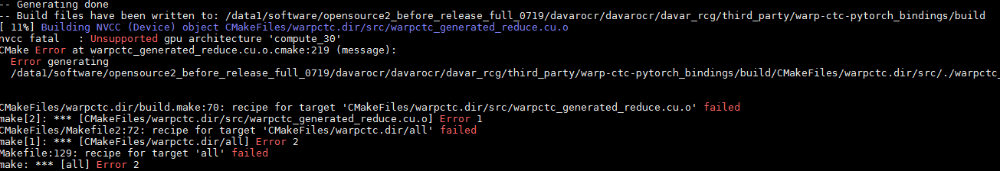

# FAQ

## Introduction

- We will sort out and collect the common questions of issues and user feedback in this document, and give relevant solutions, in order to provide reference for OCR researchers and improve work efficiency.

- There are many experts in OCR field. The answers in this document mainly rely on existing research projects. If there are any omissions or deficiencies, we hope relevant knowledgeable persons to help us to make supplement and revise them. Thank you.


## Summary of common problems in DavarOCR(Updating)

* [Installation  (2021.07.20)](Installation (2021.07.20))


## Installation (2021.07.20)

#### Q1.1: Davarocr installation error


The reason for this error is that the existing Warp_CTC does not support the GPU computing architecture (compute_30/35) when compiling based on CUDA-11.x, so the description of the corresponding part needs to be commented out during the compilation process.

```
Solutions:
    DAVAROCR_PATH= the filepath of the DavarOCR
    cd $DAVAROCR_PATH/davarocr/davar_rcg/third_party/warp-ctc-pytorch_bindings
    open the "CMakeLists.txt"

Comment the line 35~38
Line 35: # set(CUDA_NVCC_FLAGS "${CUDA_NVCC_FLAGS} -gencode arch=compute_30,code=sm_30 -O2")
Line 36: # set(CUDA_NVCC_FLAGS "${CUDA_NVCC_FLAGS} -gencode arch=compute_35,code=sm_35")
Line 37: 
Line 38: # set(CUDA_NVCC_FLAGS "${CUDA_NVCC_FLAGS} -gencode arch=compute_50,code=sm_50")
```
 
